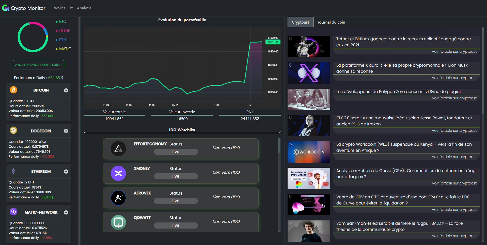
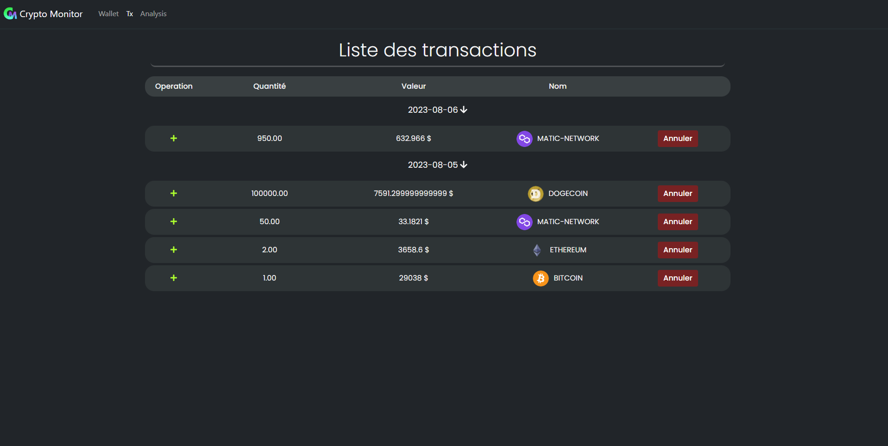
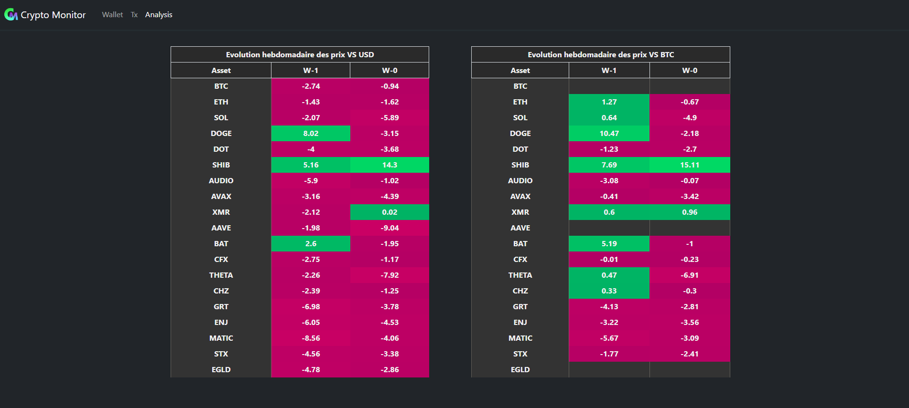

# Crypto Monitor



CryptoMonitor is a application designed to help users keep track of their cryptocurrency wallet's evolution. Besides wallet tracking, CryptoMonitor also offers a range of useful tools and provides the latest news from the cryptocurrency ecosystem.

## Features

1. **Wallet Tracking**: Keep real-time track of your cryptocurrency wallet's evolution.
2. **Tools**: Use our tools to help you make informed decisions regarding your cryptocurrencies.
3. **News**: Stay up-to-date with the latest news from the cryptocurrency ecosystem.




## Prerequisites

1. Node.js
2. MongoDB

## Installation

1. Clone the GitHub repository:
    ```bash
    git clone https://github.com/Dami246/crypto-monitor.git
    ```

2. Navigate into the project's directory:
    ```bash
    cd crypto-monitor
    ```

3. Install the back dependencies:
    ```bash
    cd back
    npm install
    ```

4. Install the back dependencies:
    ```bash
    cd front
    npm install
    ```

## Configuration

The application requires a MongoDB database. Be sure to configure your MongoDB connection string in the `config/dev.env` file.

## Running the Project

1. To run the backend server, use the following command in the terminal:
    ```bash
    npm run dev
    ```
    This will start the server in development mode.

2. To run the frontend, navigate into the frontend folder in another terminal and use the following command:
    ```bash
    npm start
    ```
    This will start the frontend server.

## Additional Scripts

1. `npm run start`: Runs the server in production mode (Raspberry PI).
2. `npm run scrapping-only`: Runs the scrapping script only.
3. `npm run test`: Runs the project's tests.

## Dependencies & Documentation used

### FRONT

* Lightweightchart (https://github.com/tradingview/lightweight-charts)
* SweetAlert (https://sweetalert.js.org/)
* Socketio(https://www.valentinog.com/blog/socket-react/)

### BACK

* Pupeeter (https://github.com/puppeteer/puppeteer)
* node-cron (https://www.digitalocean.com/community/tutorials/nodejs-cron-jobs-by-examples)
* mongoose
* express
* socketio